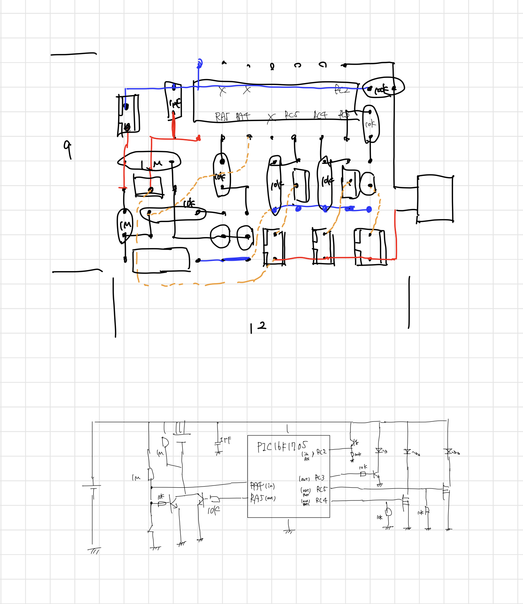

# AutoBikeLED

## コンセプト
- 既製品から取り出した回路を利用
- ヘッドライト・リアライト・サイコン照明を一つのシステムで駆動
  - リアライトは走行を検知して点灯
  - ヘッドライト・サイコン照明は走行中かつ暗いときに自動で点灯

## 回路図

## 計測値

## 昼間消費電力
0.265W (0.053A @ 5V)
- ヘッド: 3/124, テール：4/124、メーター：0/124

# 夜間消費電力
1.565W (0.313A @ 5V)
- ヘッド：24/124, テール：4/124, メーター: 3/124

### ヘッドライト
- 0.185A (0.925W) @ 5V 15/124
- 0.065A (0.325W) @ 5V 5/124
- 0.039A (0.195W) @ 5V 3/124
- 0.071A (0.2627W) @ 3.7V 15/124

- 1.010A (5.05W) @ 5V 80/124
- 0.348A (1.74W) @ 5V 27/124
- 0.305A (1.525W) @ 5V 24/124
- 0.387A (1.4319W) @ 3.7V 80/124

### メーター
- 0.007A (0.035W) @ 5V 15/124
- 0.007A (0.035W) @ 5V 5/124
- 0.007A (0.035W) @ 5V 3/124
- 0.003A (0.0111W) @ 3.7V 15/124

### テールランプ
- 0.053A (0.265W) @ 5V 10/124
- 0.028A (0.14W) @ 5V 5/124
- 0.026A (0.13W) @ 5V 4/124
- 0.030A (0.111W) @ 3.7 10/124

- 0.202A (1.01W) @ 5V 40/124
- 0.089A (0.445W) @ 5V 15/124
- 0.116A (0.4292W) @ 3.7V 40/124
